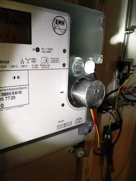
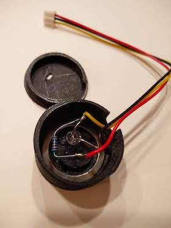
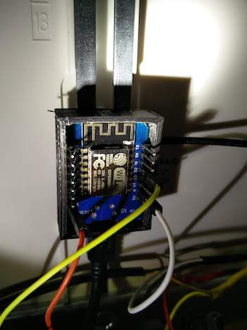
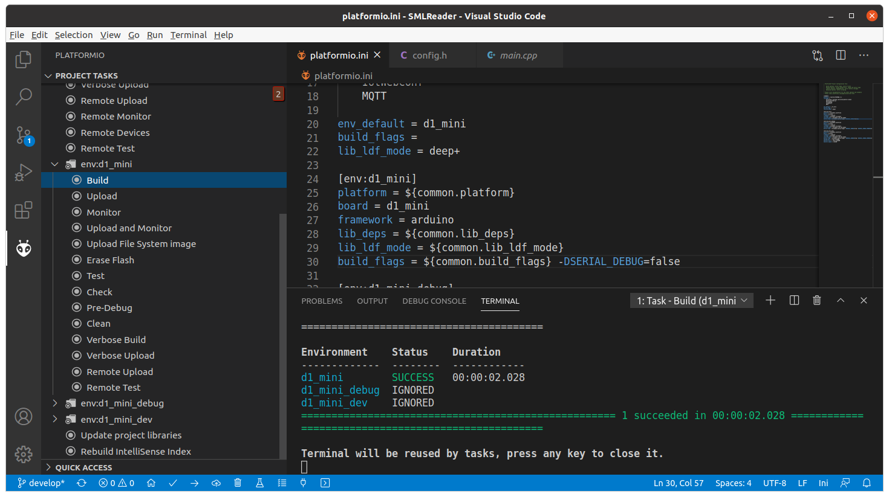
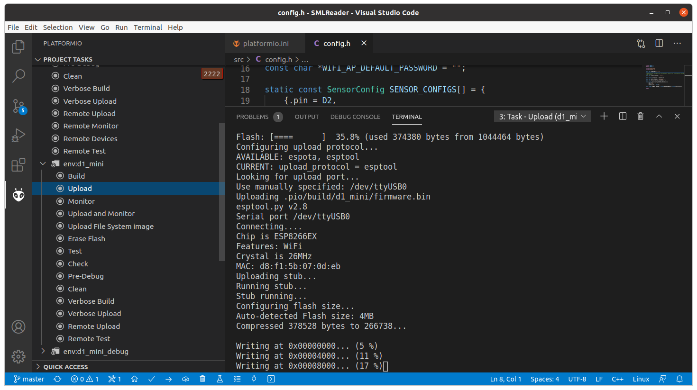
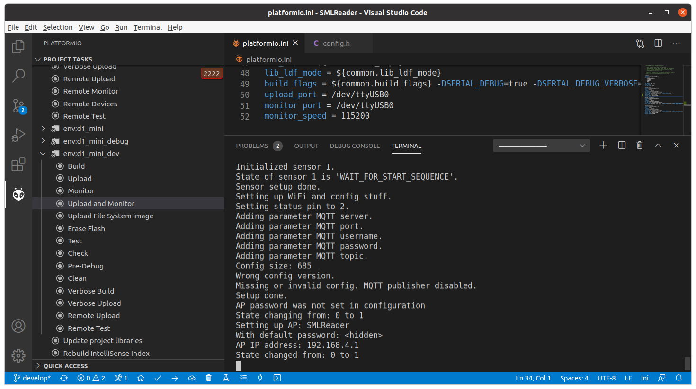

# SMLReader

An ESP8266 based smart meter (D0 / SML) to MQTT gateway 

## About

The aim of this project is to read the meter readings of modern energy meters and make them available via MQTT.

The software was primarily developed and tested for the EMH ED300L electricity meter, but should also work with other energy meters that have an optical interface and communicate via the SML protocol.

SMLReader publishes the metrics read from the meter's optical unit to an MQTT broker configured via the provided web interface.

If you like this project, you might consider to support me by [donating](#donate).

### Screenshots


### Hardware

#### Reading head

The reading head consists of a phototransistor (BPW 40) and a 1 kΩ pull-up resistor connected to one of the GPIO pins of the microcontroller.
Other phototransistors or the use of an internal pull-up resistor will probably work, too.

The housing of my reading head has been 3D-printed using the [STL files](http://www.stefan-weigert.de/php_loader/sml.php) from [Stefan Weigert](http://www.stefan-weigert.de). 

A ring magnet (in my case dimensioned 27x21x3mm) ensures that the reading head keeps stuck on the meter.

The phototransistor has been fixed with hot glue within the housing.

  

#### Schematic diagram


## Getting started

To get started, the software must first somehow get onto the device. 
This can be done in several ways.

### Uploading a precompiled binary

A precompiled binary for the Wemos D1 and configured to have a sensor attached to pin D2 can be downloaded from the releases page on GitHub:  

[https://github.com/mruettgers/SMLReader/releases](https://github.com/mruettgers/SMLReader/releases)

#### Flashing

This precompiled binary can be flashed to the device with the help of [esptool.py](https://github.com/espressif/esptool).
Other tools should also work, as long as you have configured them to match the specs of your ESP8266.

```bash
esptool.py --port /dev/ttyUSB0 write_flash -fm dout 0x00000 path/to/smlreader.bin
```

As a docker enthusiast I prefer to utilize a dockerized version of esptool.py by bind-mounting the current working directory to `/src` and assuming that `smlreader.bin` is existing in the current working directory:
```bash
docker run -it --device /dev/ttyUSB0 -v $(pwd):/src --rm mruettgers/esptool --port /dev/ttyUSB0 write_flash -fm dout 0x00000 /src/smlreader.bin
```

The device path and the path to the binary have to be adjusted to fit your needs.


##### Example

```bash
nb-ubuntu ➜  ~/Downloads  ls SMLReader_D1mini_v2.1.3.bin                                                                                                         
SMLReader_D1mini_v2.1.3.bin

nb-ubuntu ➜  ~/Downloads  docker run -it --device=/dev/ttyUSB0 -v $(pwd):/src --rm mruettgers/esptool --port /dev/ttyUSB0 write_flash -fm dout 0x00000 /src/SMLReader_D1mini_v2.1.3.bin
esptool.py v2.8
Serial port /dev/ttyUSB0
Connecting....
Detecting chip type... ESP8266
Chip is ESP8266EX
Features: WiFi
Crystal is 26MHz
MAC: d8:f1:5b:07:0d:eb
Uploading stub...
Running stub...
Stub running...
Configuring flash size...
Auto-detected Flash size: 4MB
Flash params set to 0x0340
Compressed 378528 bytes to 266738...
Wrote 378528 bytes (266738 compressed) at 0x00000000 in 23.6 seconds (effective 128.1 kbit/s)...
Hash of data verified.

Leaving...
Hard resetting via RTS pin...
```

---

### Using your IDE for building and flashing

You should be able to use your preferred IDE to build and flash SMLReader if you take care of the dependencies and the build flags configured in the `platform.io` file.
I strongly recommend using PlatformIO as it takes care of that itself.

#### Configuration

The configuration of the reading heads is done by editing `src/config.h` and adjusting  `SENSOR_CONFIGS` (see below).

```c++
static const SensorConfig SENSOR_CONFIGS[] = {
    {.pin = D2, // GPIO pin of the phototransistor
     .name = "1", // Sensor name used in MQTT topic
     .numeric_only = false, // If "true", only numeric values are being published via MQTT
     .status_led_enabled = true, // Flash status LED (3 times) when an SML start sequence has been found
     .status_led_inverted = true, // Some LEDs (like the ESP8266 builtin LED) require an inverted output signal
     .status_led_pin = LED_BUILTIN, // GPIO pin used for sensor status LED
     .interval = 0 // If greater than 0, messages are published every [interval] seconds
    },
    {.pin = D5,
     .name = "2",
     .numeric_only = false,
     .status_led_enabled = true,
     .status_led_inverted = true,
     .status_led_pin = LED_BUILTIN,
     .interval = 0
    },
    {.pin = D6,
     .name = "3",
     .numeric_only = false,
     .status_led_enabled = true,
     .status_led_inverted = true,
     .status_led_pin = LED_BUILTIN,
     .interval = 15
    }
};
```


#### Building

Building SMLReader in PlatformIO is straight forward and can be done by executing the build task matching your environment (i.e. `d1_mini`).

In case you get the following error, it is time to install a Git client (https://git-scm.com/downloads) and to make sure that the path to `git` is covered by the PATH variable and `git` is thus executable from everywhere.

```
UserSideException: Please install Git client from https://git-scm.com/downloads:
  File "/home/monty/.platformio/penv/lib/python3.8/site-packages/platformio/builder/main.py", line 168:
    env.SConscript("$BUILD_SCRIPT")
```




#### Flashing



---


### Running

WiFi and MQTT are configured via the web interface provided by [IotWebConf](https://github.com/prampec/IotWebConf) and which can be reached after joining the WiFi network named SMLReader and heading to http://192.168.4.1.   
If the device has already been configured, the web interface can be reached via the IP address obtained from your local network's DHCP server.
To login provide the user `admin` and the configured AP password.

*Attention: You have to change the AP Password (empty by default), otherwise SMLReader won't work.*

If everything is configured properly and running with a sensor in place, SMLReader will publish the metrics and values received from the meter to the configured MQTT broker:

```
MB-Monty ➜  ~  mosquitto_sub -h 10.4.32.103 -v -t smartmeter/mains/#
smartmeter/mains/info Hello from 00C7551E, running SMLReader version 2.1.5.
smartmeter/mains/sensor/1/obis/1-0:1.8.0/255/value 3546245.9
smartmeter/mains/sensor/1/obis/1-0:2.8.0/255/value 13.2
smartmeter/mains/sensor/1/obis/1-0:1.8.1/255/value 0.0
smartmeter/mains/sensor/1/obis/1-0:2.8.1/255/value 13.2
smartmeter/mains/sensor/1/obis/1-0:1.8.2/255/value 3546245.9
smartmeter/mains/sensor/1/obis/1-0:2.8.2/255/value 0.0
smartmeter/mains/sensor/1/obis/1-0:16.7.0/255/value 451.2

smartmeter/mains/sensor/2/obis/1-0:1.8.0/255/value 3546245.9
smartmeter/mains/sensor/2/obis/1-0:2.8.0/255/value 13.2
smartmeter/mains/sensor/2/obis/1-0:1.8.1/255/value 0.0
smartmeter/mains/sensor/2/obis/1-0:2.8.1/255/value 13.2
smartmeter/mains/sensor/2/obis/1-0:1.8.2/255/value 3546245.9
smartmeter/mains/sensor/2/obis/1-0:2.8.2/255/value 0.0
smartmeter/mains/sensor/2/obis/1-0:16.7.0/255/value 451.2

smartmeter/mains/sensor/3/obis/1-0:1.8.0/255/value 3546245.9
smartmeter/mains/sensor/3/obis/1-0:2.8.0/255/value 13.2
smartmeter/mains/sensor/3/obis/1-0:1.8.1/255/value 0.0
smartmeter/mains/sensor/3/obis/1-0:2.8.1/255/value 13.2
smartmeter/mains/sensor/3/obis/1-0:1.8.2/255/value 3546245.9
smartmeter/mains/sensor/3/obis/1-0:2.8.2/255/value 0.0
smartmeter/mains/sensor/3/obis/1-0:16.7.0/255/value 451.2
```

---


### Debugging

Serial logging can be enabled by setting `SERIAL_DEBUG=true` in the `platformio.ini` file before building.
To increase the log level and to get the raw SML data, also set `SERIAL_DEBUG_VERBOSE=true`.

#### Serial port monitor

A serial port monitor can be attached using the corresponding function of your IDE or by invoking a terminal client like `miniterm` which comes shipped with `python-serial`.
The serial port settings are `115200,8,N,1`.

##### miniterm.py

```bash
miniterm /dev/ttyUSB0 115200
```

###### Example

```bash
nb-ubuntu ➜  ~/Downloads  miniterm /dev/ttyUSB0 115200
--- Miniterm on /dev/ttyUSB0  115200,8,N,1 ---
--- Quit: Ctrl+] | Menu: Ctrl+T | Help: Ctrl+T followed by Ctrl+H ---
Config size: 685
Wrong config version.
AP password was not set in configuration
State changing from: 0 to 1
Setting up AP: SMLReader
With default password: <hidden>
AP IP address: 192.168.4.1
State changed from: 0 to 1
...
```

Or the dockerized way:

```bash
docker run -it --device /dev/ttyUSB0 -v $(pwd):/src --rm mruettgers/esptool ash -c "miniterm.py /dev/ttyUSB0 115200"
```


##### PlatformIO




---

## Acknowledgements

### Third party libraries
* [ESPSoftwareSerial](https://github.com/plerup/espsoftwareserial)
* [IotWebConf](https://github.com/prampec/IotWebConf)
* [MicroDebug](https://github.com/rlogiacco/MicroDebug)
* [MQTT](https://github.com/256dpi/arduino-mqtt)
* [libSML](https://github.com/volkszaehler/libsml)
* [JLed](https://github.com/jandelgado/jled)

### Links

* https://www.msxfaq.de/sonst/bastelbude/smartmeter_d0_sml_protokoll.htm
* https://www.photovoltaikforum.com/thread/78798-sml-pr%C3%BCfsummenberechnung-ich-verzweifle-an-crc/ (Helped me to finally solve some weird CRC calculation issues before switching over to libSML)
* http://www.stefan-weigert.de/php_loader/sml.php (Sources of the 3D-printed housing of the reading head)
* https://github.com/gemu2015/Sonoff-Tasmota (Gemu's excellent Tasmota version with SML support)

## Donate

### Bitcoin
16XujKGLtx1Lp9ZTvdbpY6Km7jbLHjW2sD

### Paypal
[](https://www.paypal.com/cgi-bin/webscr?cmd=_s-xclick&hosted_button_id=GK95YZCEGJT84)

### Buy me a coffee
<a href="https://www.buymeacoffee.com/fkqeNT2" target="_blank"></a>

## Roadmap

* [ ] Use SPIFFS for config storage

## License

Distributed under the GPL v3 license.  
See [LICENSE](LICENSE) for more information.
