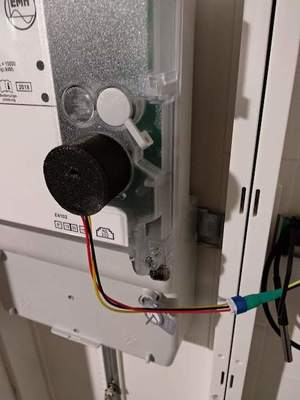
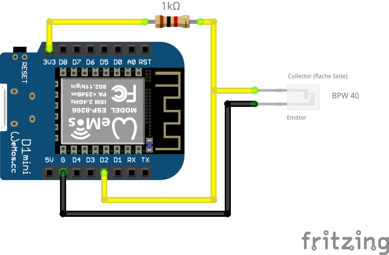

# SMLReader

A smart meter (SML) to MQTT gateway

## Documentation

This documentation is a work in progress.

## About

The aim of this project is to read the meter readings of modern energy meters and make them available via MQTT.

The software was primarily developed and tested for the EMH ED300L electricity meter, but should also work with other energy meters that have an optical interface and communicate via the SML protocol.

SMLReader publishes the metrics read from the meter's optical unit to an MQTT broker configured via the provided web interface.

### Screenshots


### Hardware

#### Reading head

The reading head consists of a phototransistor (BPW 40) and a 1 kΩ pull-up resistor connected to one of the GPIO pins of the microcontroller.
Other phototransistors or the use of an internal pull-up resistor will probably work, too.

The housing of my reading head has been 3D-printed using the [STL files](http://www.stefan-weigert.de/php_loader/sml.php) from [Stefan Weigert](http://www.stefan-weigert.de). 

A ring magnet (in my case dimensioned 27x21x3mm) ensures that the reading head keeps stuck on the meter.

The phototransistor has been fixed with hot glue within the housing.

 

#### Schematic diagram


## Getting started

### Configuration

The static configuration is done by editing `src/config.h` and adjusting the proper variables.

```c++
static const SensorConfig SENSOR_CONFIGS[] = {
    {.pin = D2,
     .name = "1",
     .numeric_only = false},
    {.pin = D5,
     .name = "2",
     .numeric_only = false},
    {.pin = D6,
    .name = "3",
    .numeric_only = false}};
```
*Attention: Multi-sensor support is experimental and has not been tested due to the lack of multiple meters. For testing purposes I connected one reading head to multiple GPIO pins of my WeMos D1 mini.*

WiFi and MQTT are configured via the web interface provided by [IotWebConf](https://github.com/prampec/IotWebConf) and which can be reached after joining the WiFi network named SMLReader and heading to http://192.168.4.1.   
If the device has already been configured,  the web interface can be reached via the IP address obtained from your local network's DHCP server.

### Running

If everything is configured properly and running with a sensor in place, SMLReader will  publish all numeric metrics received from the meter to the configured MQTT broker:

```
MB-Monty ➜  ~  mosquitto_sub -h 10.4.32.103 -v -t smartmeter/mains/#
smartmeter/mains/info Hello from 00C7551E, running SMLReader version 1.0.1.
smartmeter/mains/sensor/1/obis/1-0:1.8.0/value 3469015.0
smartmeter/mains/sensor/1/obis/1-0:2.8.0/value 13.2
smartmeter/mains/sensor/1/obis/1-0:1.8.1/value 0.0
smartmeter/mains/sensor/1/obis/1-0:2.8.1/value 13.2
smartmeter/mains/sensor/1/obis/1-0:1.8.2/value 3469015.0
smartmeter/mains/sensor/1/obis/1-0:2.8.2/value 0.0
smartmeter/mains/sensor/1/obis/1-0:16.7.0/value 302.2

smartmeter/mains/sensor/2/obis/1-0:1.8.0/value 3531049.9
smartmeter/mains/sensor/2/obis/1-0:2.8.0/value 13.2
smartmeter/mains/sensor/2/obis/1-0:1.8.1/value 0.0
smartmeter/mains/sensor/2/obis/1-0:2.8.1/value 13.2
smartmeter/mains/sensor/2/obis/1-0:1.8.2/value 3531050.0
smartmeter/mains/sensor/2/obis/1-0:2.8.2/value 0.0
smartmeter/mains/sensor/2/obis/1-0:16.7.0/value 2366.8

smartmeter/mains/sensor/3/obis/1-0:1.8.0/value 3531049.9
smartmeter/mains/sensor/3/obis/1-0:2.8.0/value 13.2
smartmeter/mains/sensor/3/obis/1-0:1.8.1/value 0.0
smartmeter/mains/sensor/3/obis/1-0:2.8.1/value 13.2
smartmeter/mains/sensor/3/obis/1-0:1.8.2/value 3531050.0
smartmeter/mains/sensor/3/obis/1-0:2.8.2/value 0.0
smartmeter/mains/sensor/3/obis/1-0:16.7.0/value 2366.8
```

### Debugging

Verbose serial logging can be enabled by setting `SERIAL_DEBUG_VERBOSE=true` in the `platformio.ini` file.


---

## Acknowledgements

### Third party libraries
* [ESPSoftwareSerial](https://github.com/plerup/espsoftwareserial)
* [IotWebConf](https://github.com/prampec/IotWebConf)
* [MicroDebug](https://github.com/rlogiacco/MicroDebug)
* [MQTT](https://github.com/256dpi/arduino-mqtt)
* [libSML](https://github.com/volkszaehler/libsml)

### Links

* https://www.msxfaq.de/sonst/bastelbude/smartmeter_d0_sml_protokoll.htm
* https://www.photovoltaikforum.com/thread/78798-sml-pr%C3%BCfsummenberechnung-ich-verzweifle-an-crc/ (Helped me to finally solve some weird CRC calculation issues before switching over to libSML)
* http://www.stefan-weigert.de/php_loader/sml.php (Sources of the 3D-printed housing of the reading head)
* https://github.com/gemu2015/Sonoff-Tasmota (Gemu's excellent Tasmota version with SML support)

## Donate

<a href="https://www.buymeacoffee.com/fkqeNT2" target="_blank"></a>

## License

Distributed under the GPL v3 license.  
See [LICENSE](LICENSE) for more information.
