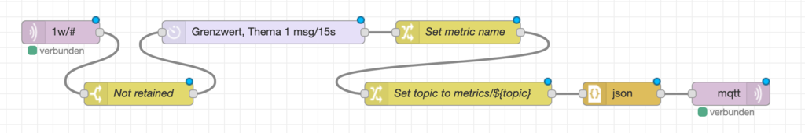

# SMLReader
ESP8266 based SmartMeter (SML) to 1-Wire gateway

## Description
The aim of this project is to read the meter readings of modern energy meters and make them available via the 1-Wire bus.

The software was primarily developed and tested for the EMH ED300L electricity meter, but should also work with other energy meters that have an optical interface and communicate via the SML protocol.

The SMLReader basically works by emulating a 1-Wire slave device, in this case a [BAE0910](http://www.brain4home.eu/downloads/BAE0910-datasheet.pdf).
Metrics that have been read from the optical unit of the meter are provided via the available 32 bit registers of the BAE0910 (`userm`, `usern`, `usero`, `userp`).

The emulation of the 1-Wire slave device is realized by the use of [OneWireHub](https://github.com/orgua/OneWireHub).

## Schematic diagram

## Hardware

### Reading head

The reading head consists of a phototransistor (BPW 40) and a 1 kΩ pull-up resistor connected to one of the GPIO pins of the microcontroller.
Other phototransistors or the use of an internal pull-up resistor will probably work, too, but that has not been tested so far.

The housing of my reading head has been 3D-printed using the [STL files](http://www.stefan-weigert.de/php_loader/sml.php) from [Stefan Weigert](http://www.stefan-weigert.de). 

A ring magnet (in my case dimensioned 27x21x3mm) ensures that the reading head keeps stuck on the meter.

The phototransistor has been fixed with hot glue within the housing.

 

## Software

### Customization

TBD.

### Build

TBD.

### Installation

For flashing I usually use a dockerized version of [esptool.py](https://github.com/espressif/esptool) on one of the dozen Raspberry Pis lying around.

##### Alias for utilizing docker and mounting the current working directory to `/src`
`alias esp="docker run -it --device=/dev/ttyUSB0 -v \$(pwd):/src --rm mruettgers/rpi-esptool"`

##### Flash the image
`esp --port /dev/ttyUSB0 write_flash -fm dout 0x00000 /src/firmware.bin`

##### Serial console monitor
`esp miniterm /dev/ttyUSB0 115000`

## Usage

My setup consists of a dockerized version of the **owserver** from the [owfs](https://github.com/owfs/owfs) project, connected via a Dallas DS9490R Busmaster to the 1-Wire bus, and of Node-RED, of course also running as a docker container.
Node-RED is responsible for fetching the metrics from **owserver** and for publishing them via MQTT. The metrics are then re-published by Node-RED to another topic starting with `metrics/` for being consumed by the data collector of a time series database.

See my sample [docker-compose.yaml](assets/docker/docker-compose.yaml) to see how things are linked together.

### Metric fetching
The metrics are read at given intervals by a Node-RED flow and are then published via MQTT.

The source of the flow can be found [here](assets/nodered/nodered_flow_ow.json).

### Re-publishing for time series database processing
Another Node-RED flow re-publishes the metrics for being consumed by [InfluxDB](https://github.com/influxdata/influxdb) and especially by its data collector [Telegraf](https://github.com/influxdata/telegraf).

The source of the flow can be found [here](assets/nodered/nodered_flow_metrics.json).  
A Telegraf configuration example can be found [here](assets/telegraf/telegraf.conf).
